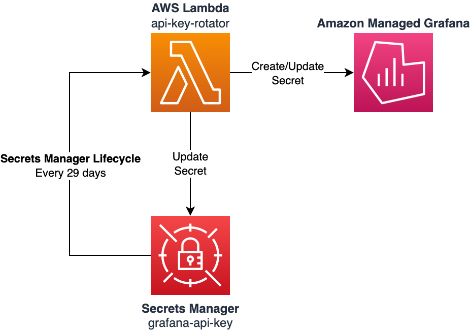

# Amazon Managed Grafana API Key Rotation

A simple terraform module that can rotate an API key for an Amazon Managed Grafana instance.

<!-- BEGIN_TF_DOCS -->
## Requirements

| Name | Version |
|------|---------|
|  [terraform](#requirement\_terraform) | >= 1.7 |
|  [archive](#requirement\_archive) | ~> 2.0 |
|  [aws](#requirement\_aws) | ~> 5.0 |
|  [null](#requirement\_null) | ~> 3.0 |

## Providers

| Name | Version |
|------|---------|
|  [archive](#provider\_archive) | ~> 2.0 |
|  [aws](#provider\_aws) | ~> 5.0 |
|  [null](#provider\_null) | ~> 3.0 |

## Modules

No modules.

## Resources

| Name | Type |
|------|------|
| [aws_iam_role.api_key_rotation_lambda_role](https://registry.terraform.io/providers/hashicorp/aws/latest/docs/resources/iam_role) | resource |
| [aws_iam_role_policy.api_key_rotation_lambda_policy](https://registry.terraform.io/providers/hashicorp/aws/latest/docs/resources/iam_role_policy) | resource |
| [aws_lambda_function.api_key_rotation](https://registry.terraform.io/providers/hashicorp/aws/latest/docs/resources/lambda_function) | resource |
| [aws_lambda_permission.secrets_manager_api_key_rotation](https://registry.terraform.io/providers/hashicorp/aws/latest/docs/resources/lambda_permission) | resource |
| [aws_secretsmanager_secret.api_key](https://registry.terraform.io/providers/hashicorp/aws/latest/docs/resources/secretsmanager_secret) | resource |
| [aws_secretsmanager_secret_rotation.api_key](https://registry.terraform.io/providers/hashicorp/aws/latest/docs/resources/secretsmanager_secret_rotation) | resource |
| [null_resource.api_key_delay](https://registry.terraform.io/providers/hashicorp/null/latest/docs/resources/resource) | resource |
| [archive_file.api_key_lambda](https://registry.terraform.io/providers/hashicorp/archive/latest/docs/data-sources/file) | data source |
| [aws_caller_identity.current](https://registry.terraform.io/providers/hashicorp/aws/latest/docs/data-sources/caller_identity) | data source |
| [aws_iam_policy_document.api_key_rotation_lambda_assume_role_policy_document](https://registry.terraform.io/providers/hashicorp/aws/latest/docs/data-sources/iam_policy_document) | data source |
| [aws_iam_policy_document.api_key_rotation_lambda_execution_role_policy_document](https://registry.terraform.io/providers/hashicorp/aws/latest/docs/data-sources/iam_policy_document) | data source |
| [aws_region.current](https://registry.terraform.io/providers/hashicorp/aws/latest/docs/data-sources/region) | data source |
| [aws_secretsmanager_secret.api_key](https://registry.terraform.io/providers/hashicorp/aws/latest/docs/data-sources/secretsmanager_secret) | data source |
| [aws_secretsmanager_secret_version.api_key](https://registry.terraform.io/providers/hashicorp/aws/latest/docs/data-sources/secretsmanager_secret_version) | data source |

## Inputs

| Name | Description | Type | Default | Required |
|------|-------------|------|---------|:--------:|
|  [grafana\_workspace\_id](#input\_grafana\_workspace\_id) | The ID of the Grafana workspace to manage | `string` | n/a | yes |
|  [key\_role](#input\_key\_role) | Set the Role for the API key. This can be ADMIN, EDITOR or VIEWER. Default is ADMIN. | `string` | `"ADMIN"` | no |
|  [name](#input\_name) | Named identifier for the workspace and related resources | `string` | n/a | yes |

## Outputs

| Name | Description |
|------|-------------|
|  [workspace\_api\_key](#output\_workspace\_api\_key) | The API key for the AWS Managed Grafana workspace |
<!-- END_TF_DOCS -->